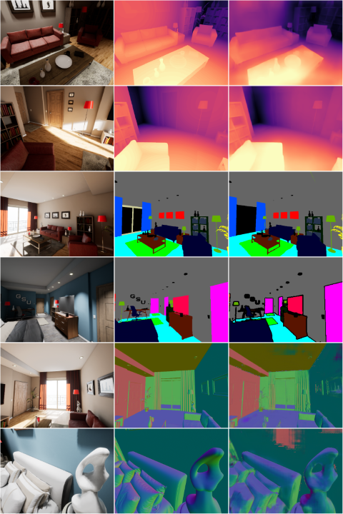
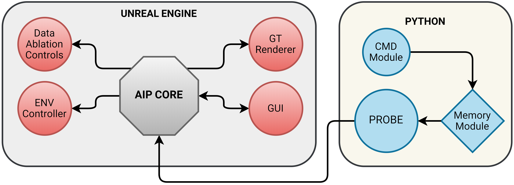

# AI Playground: An Unreal Engine Based Data Ablation tool

{

A Virtual Environment for Various Machine Learning and/or a Dataset Generation tool for Image processing Uses
AIP Can be used to Generate Entire Datasets for various Machine Learning uses. It supports Depth Estimation, Surface Normal Estimation and Pixelwise Segmentation for up to 256 Classes out of the box. It can be used for Reinforcement Learning, SLAM and General Machine learning / Datasets Education.

AI playground is a Unreal Engine 4 Based Virtual Environment for Gathering Image Data Actively or Passively. 
AIP Features Keyboard macros and an interaction Module named "Probe"  that can remember and reproduce the same Image over different circumstances. 

AIP's code can be used to make new environments while keeping the features for other purposes.

## Features: 
##### - Segmentation Glass: 
Press G for a Global Class Based Pixelwise labels. 
Press 0-9 and Ctrl+1 to Ctrl+4 to Access Binary Class-based Pixelwise Labels.
##### - Surface Normals Glass:
Press R to view the Pixelwise Surface normal in 6 Axis represented by 6 Unique Colors.
##### - Depth Glass:
Press T to view the prespective Depth (Distance of each pixel to the camera) 
##### - Other Glasses: 
 E for Greyscale Colors
 H, J, K, L for Very High, High, Medium, Low Graphics 
 B for Unlit Pass 
 Y, U, I, O for Switching Between Maps 
 

AIP:
1. Download and Run AIP.exe 
