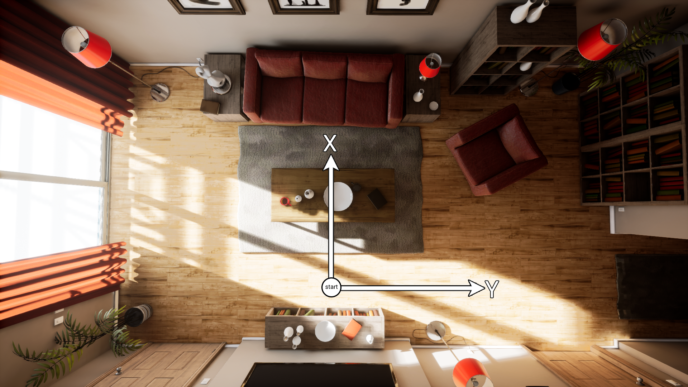

# AI Playground: An Unreal Engine Based Data Ablation tool

  

 Image, Ground Truth, Prediction 

### Citation: 
[Paper](https://scholar.google.com/scholar?cluster=12023602735105988107&hl=en&as_sdt=0,11#d=gs_cit&u=%2Fscholar%3Fq%3Dinfo%3AC1Zo2vtq3KYJ%3Ascholar.google.com%2F%26output%3Dcite%26scirp%3D0%26scfhb%3D1%26hl%3Den)

## What Is Data Ablation?
Data Ablation enables you to test the effects of various aspects of data on a ML model, Image processing Algorithm or an AI Agent.For example, to change the color of a couch one would need to swap out two otherwise identical couches and place them in the same, exact location. Aside from its difficulty, this approach is not feasible for natural scenes or crowd-sourced data. 
AIP will allow you to do just that, and more. with various settings for you to customize like lighting, fidelity (reflections, antialiasing, shadows, render scaling, etc), you will be able to generate vast datasets of otherwise identical images but with subtle differences to isolate and study the effects of different settings on your Model.

## AIP:
A Virtual Environment for Various Machine Learning and/or a Dataset Generation tool for Image processing Uses
AIP Can be used to Generate Entire Datasets for various Machine Learning uses. It supports Depth Estimation, Surface Normal Estimation and Pixelwise Segmentation for up to 256 Classes out of the box. It can be used for Reinforcement Learning, SLAM and General Machine learning / Datasets Education.

AI playground is a Unreal Engine 4 Based Virtual Environment for Gathering Image Data Actively or Passively. 
AIP Features Keyboard macros and an interaction Module named "Probe"  that can remember and reproduce the same Image over different circumstances. 

AIP's code can be used to make new environments while keeping the features for other purposes.

  

## How to use: 
### - Using the App:
    Step 1: Download Probe
    Step 2: Set up Probe in Python
    Step 3: Download and Open AIPlayground.exe 
    Step 4: Run Probe.
    
    Probe Will now start gathering Images based on your setup specifications. Memory module will be saved in a folder called "Probe". If you need to reproduce the images, you need to make sure to save that file.
    
### - Using the Source Code:
    Step 1: Download AIP Core
    Step 2: Import AIP Core Folders into any Unreal Engine Project
    Step 3: Set up your Game Mode and Default Pawn to AIP
    Step 4: Import the Input settings file provided in the AIP Core
    Step 5: Run the Project
    Step 6: Export your project or Run it in an independent window. Probe will recognize your Window handle and start sending commands to it. 
    
    Probe Will now start gathering Images based on your setup specifications. Memory module will be saved in a folder called "Probe". If you need to reproduce the images, you need to make sure to save that file.
## Hotkeys: 
##### - Segmentation Glass: 
Press G for a Global Class Based Pixelwise labels. 
Press 0-9 and Ctrl+1 to Ctrl+4 to Access Binary Class-based Pixelwise Labels.
##### - Surface Normals Glass:
Press R to view the Pixelwise Surface normal in 6 Axis represented by 6 Unique Colors.
##### - Depth Glass:
Press T to view the prespective Depth (Distance of each pixel to the camera) 
##### - Other Glasses: 
 E for Greyscale Colors
 H, J, K, L for Very High, High, Medium, Low Graphics 
 B for Unlit Pass 
 Y, U, I, O for Switching Between Maps 
 

Map: 

  

